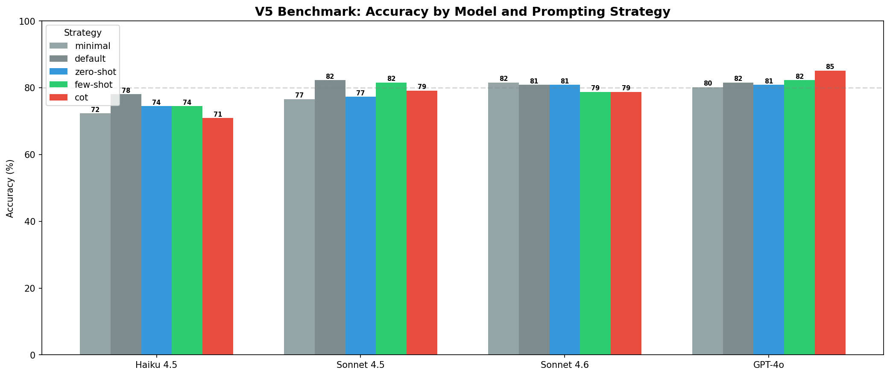
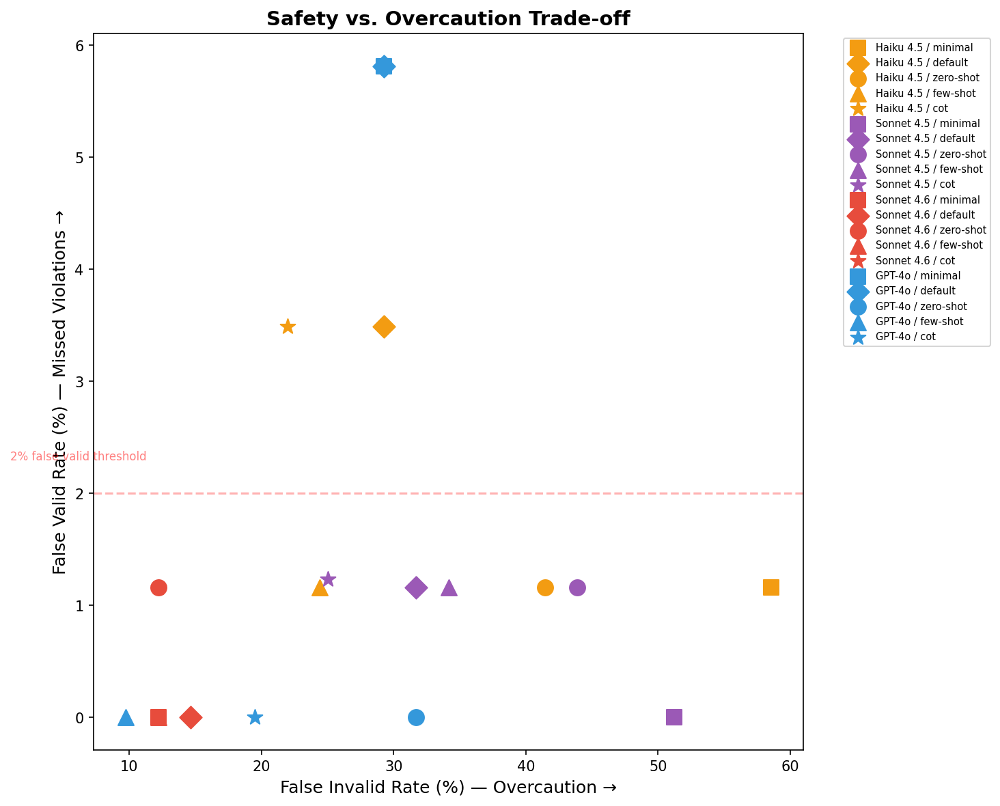
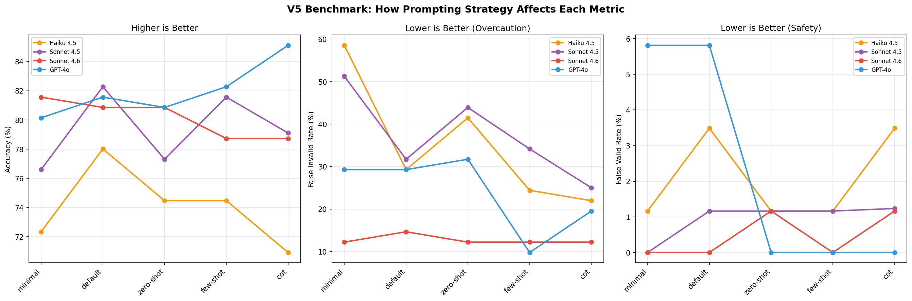
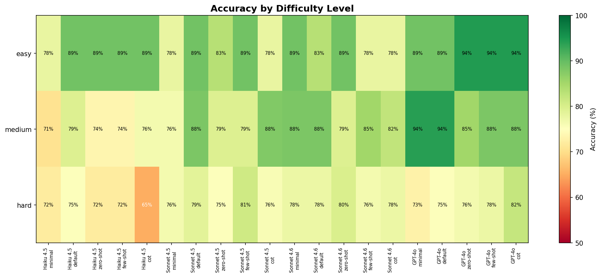
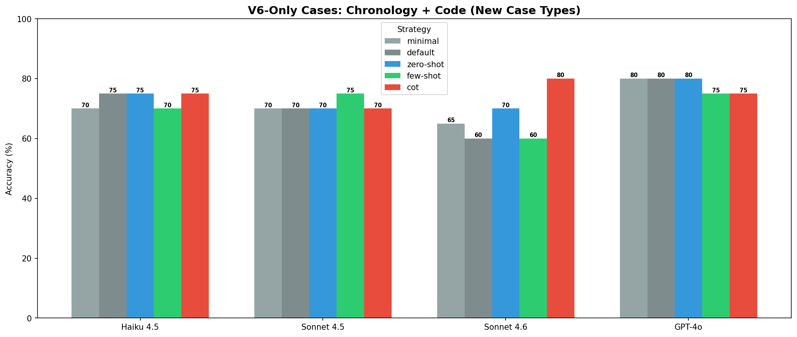

# Backtest Lie Detector: Benchmarking LLMs as Point-in-Time Auditors for Financial Research

*UChicago Generative AI for Finance, Spring 2026*

---

## Executive Summary

Large Language Models are increasingly used to write, review, and audit trading strategies and financial research. But can they catch the subtle data leakage issues that invalidate backtests? We created a benchmark to find out.

**Key Findings (V5 main benchmark, extended in V6):**
> 1. LLMs are excellent at catching obvious violations but **overly cautious** on edge cases
> 2. **Simple vs specialized prompts**: Generic prompts have higher accuracy on average, but **specialized prompts catch 100% of subtle violations**
> 3. Models struggle to express uncertainty when the correct answer is ambiguous
> 4. **The prompt engineering paradox is nuanced** - V5 false valid traps show specialized prompts matter for hard cases

**V5 Results Summary (141 cases):**
- **GPT-4o (Generic):** 83.7% accuracy, 4.7% false valid rate
- **GPT-4o (Specialized):** 80.9% accuracy, **0.0% false valid rate**
- **Claude Sonnet:** 77.3% accuracy, 1.2% false valid rate
- **GPT-4o-mini (Generic):** 64.5% accuracy, **0.0% false valid rate**, 95.1% false invalid rate
- **GPT-4o-mini (Specialized):** 62.4% accuracy, **0.0% false valid rate**, 97.6% false invalid rate
- **On 16 subtle false-valid-trap cases:** GPT-4o Generic missed 4; GPT-4o Specialized missed 0 (one flagged ambiguous); Claude Sonnet missed 0

---

## The Problem: Silent Data Leakage in Financial Research

Financial backtests and event studies are powerful tools, but they're prone to subtle errors that can completely invalidate results. These errors often involve using information that *looks* available but actually wasn't at the historical decision point.

### Common Point-in-Time Errors

| Error Type | Example | Why It Matters |
|------------|---------|----------------|
| **Ticker Time Travel** | Using META ticker for 2018 Facebook events | META didn't exist until 2022; the ticker was FB |
| **Filing Clock Leakage** | Trading at 3:55 PM on news from a 4:07 PM filing | The information wasn't public yet |
| **Accounting Availability** | Using FY2022 data in January 2023 | The 10-K wasn't filed until February |
| **Survivorship Bias** | Backtesting only on currently-listed firms | Excludes bankruptcies, acquisitions, failures |

These errors are easy to make and hard to catch. A backtest can look perfectly reasonable while containing fatal flaws.

---

## Relationship to Hallucination Benchmarks

Existing LLM benchmarks like AA-Omniscience and TruthfulQA test whether models make up facts. They ask questions like "What year did X happen?" and measure whether the model gives correct answers or hallucinates incorrect ones. These benchmarks test factual recall.

Our benchmark tests something different: can LLMs recognize when events are out of chronological order? Instead of asking "What is the date?", we ask "Is this sequence of events possible given these dates?" This is anachronism detection rather than fact retrieval.

| Aspect | Hallucination Benchmarks | This Benchmark |
|--------|-------------------------|----------------|
| Tests | Does the LLM know facts? | Does the LLM understand temporal ordering? |
| Question type | "What is X?" | "Is this workflow chronologically valid?" |
| Failure mode | Making up facts | Missing anachronisms |
| Domain | General knowledge | Finance-specific workflows |

Both types of benchmarks measure reliability, but they target different capabilities. A model could score well on factual recall (knowing that META started trading June 9, 2022) but still miss the anachronism when that fact appears in context (using META for a June 1, 2022 trade). Our benchmark tests whether models can apply temporal knowledge to detect impossible sequences.

---

## Benchmark Evolution: V1 → V6

The benchmark evolved over six iterations, each adding cases that targeted a specific weakness exposed by the prior version:

| Version | Cases | Description | Key Finding |
|---------|-------|-------------|-------------|
| V1 | 42 | Original seed cases | 97.6% accuracy - too easy |
| V2 | 69 | +17 adversarial, +10 WRDS | 95.7% accuracy - harder |
| V3 | 105 | +36 hard source-backed | 84.8% accuracy - challenging |
| V4 | 125 | +20 calibration-focused | 79.2% accuracy - overcaution revealed |
| V5 | 141 | +16 false valid traps | Nuanced findings on prompt engineering |
| **V6** | **+15 chronology, +12 code** (run as separate batteries) | Pure temporal reasoning and code auditing | **Overcaution persists outside the finance domain** |

### V5 Benchmark Structure

```
┌─────────────────────────────────────────────────────────────────────┐
│                    V5 Benchmark Structure (141 cases)                │
├─────────────────────┬──────────────────┬───────────────────────────┤
│ Ticker Time Machine │ Filing Clock     │ Accounting Availability   │
│ (48 cases)          │ (31 cases)       │ (24 cases)                │
├─────────────────────┴──────────────────┴───────────────────────────┤
│              Survivorship & Delisting (38 cases)                    │
├─────────────────────────────────────────────────────────────────────┤
│  Expected Validity:  Valid: 41  |  Invalid: 86  |  Ambiguous: 14   │
├─────────────────────────────────────────────────────────────────────┤
│  Special Tags:  trap_valid: 22 | false_valid_trap: 16 | near_miss: 17 │
└─────────────────────────────────────────────────────────────────────┘
```

**V5 False Valid Trap Cases (16 new):**
- Workflows with **professional language** that sounds point-in-time valid
- Hidden **implementation-level bugs** requiring dataset semantics knowledge
- All labeled as `invalid` but designed to trigger **false valid errors**

---

## Case Families (13 Source-Backed Families)

V3/V4 includes hard cases based on real-world finance traps. Each family is tied to authoritative documentation:

| # | Family | Example | Source |
|---|--------|---------|--------|
| 1 | **Ticker Reassignment** | Sears S → Sprint S, 2005 | CRSP Stock Header documentation |
| 2 | **Security Reorganization** | Manville bankruptcy PERMNO split | CRSP Event documentation |
| 3 | **FB-to-META Timing** | June 9, 2022 intraday transition | Meta SEC 8-K filing (June 2022) |
| 4 | **GOOG vs GOOGL** | Share class for governance studies | Alphabet Proxy Statement (2014) |
| 5 | **IBM/Kyndryl Spinoff** | November 2021 distribution | IBM SEC Form 10 filing |
| 6 | **SEC Filing Clock** | 5:30 PM acceptance rules | SEC EDGAR Filer Manual |
| 7 | **S&P Index Timing** | Announcement vs effective date | S&P Index Methodology Guide |
| 8 | **Erroneous Announcements** | Revoked index changes | Historical S&P press releases |
| 9 | **Compustat Current vs PIT** | Snapshot methodology | WRDS Compustat documentation |
| 10 | **As-Filed vs Standardized** | XBRL extraction differences | Compustat User Guide |
| 11 | **Adjusted Price Semantics** | Returns vs levels | CRSP Data Definitions Manual |
| 12 | **Delisting Returns** | Conservative imputation | Shumway (1997), Shumway & Warther (1999) |
| 13 | **Earnings Timing** | Pre-market vs after-close | I/B/E/S Timing Flag documentation |

---

## Ground Truth Labeling Protocol

### Validity Labels

Each benchmark case is labeled with one of three validity values:

| Label | Definition | Criteria |
|-------|------------|----------|
| **Valid** | Workflow is point-in-time correct | All data used was publicly available at decision time; identifiers correctly match the historical period |
| **Invalid** | Clear violation identifiable from prompt | At least one unambiguous point-in-time error is present |
| **Ambiguous** | Missing critical information | Cannot determine validity without additional context |

### When is "Ambiguous" Correct?

A case is labeled ambiguous **only** when the prompt lacks information required to determine point-in-time validity. The five categories that trigger ambiguous labels:

1. **Missing filing acceptance timestamp** - The filing date is given but not the exact acceptance time needed to determine same-day availability
2. **Unspecified accounting lag methodology** - Uses Compustat data but doesn't specify whether point-in-time snapshots or standard lag was applied
3. **Missing share-class purpose specification** - Uses GOOG vs GOOGL without clarifying if share class matters for the research question
4. **Missing event decision timestamp** - Trading decision time unclear relative to information release
5. **Unspecified data source version** - Doesn't clarify if using current download or historical snapshot

### Examples from Benchmark

| Case ID | Label | Why This Label |
|---------|-------|----------------|
| `cal_ambig_filing_no_timestamp` | Ambiguous | "Filed on March 15" - no acceptance time given |
| `cal_ambig_compustat_unknown_lag` | Ambiguous | Uses Compustat for June portfolio - lag method unspecified |
| `cal_valid_crsp_adjusted_return` | Valid | CRSP `ret` field correctly handles spinoff adjustments |
| `hard_meta_june9_intraday` | Invalid | Uses META at 10 AM on June 9, 2022 - ticker changed at market open |

---

## V4 Results: Multi-Model Comparison

### Model Leaderboard

| Configuration | Accuracy | False Invalid | False Valid | Ambiguous Acc |
|---------------|----------|---------------|-------------|---------------|
| GPT-4o (Generic) | **84.8%** | **17.1%** | 0.0% | 21.4% |
| GPT-4o (Specialized) | 79.2% | 31.7% | 0.0% | 21.4% |
| Claude Sonnet 4.5 | 74.4% | 46.3% | 1.4% | 14.3% |

### Baseline Comparison

| Baseline | Accuracy | False Invalid | False Valid |
|----------|----------|---------------|-------------|
| Always Invalid | 56.0% | 100.0% | 0.0% |
| Keyword Suspicion | 40.8% | 4.9% | 82.9% |
| Rule-Based | 38.4% | 14.6% | 81.4% |
| Always Valid | 32.8% | 0.0% | 100.0% |

**Key insight:** LLMs dramatically outperform rule-based approaches on violation detection (0–1.4% false valid vs 81–100%), while baselines help contextualize that LLM overcaution (17–46% false invalid) is still far better than naive "always invalid" (100%).

### Repair Quality Analysis

Beyond classification, we evaluated whether models propose *useful* repairs (30 cases sampled per model):

| Model | Correct | Partial | Wrong/Vague |
|-------|---------|---------|-------------|
| Claude Sonnet | **66.7%** | 30.0% | 3.3% |
| GPT-4o (Specialized) | 40.0% | 36.7% | 23.3% |
| GPT-4o (Generic) | 36.7% | 26.7% | 36.7% |

**Surprising finding:** Claude Sonnet produces significantly better repair suggestions despite lower classification accuracy. This suggests Claude's overcaution may stem from *deeper understanding* of potential issues, even when the workflow is actually valid.

### The Surprising Finding: Simpler Is Better

The generic prompt **outperformed** the specialized finance auditor prompt by 4 percentage points. This reveals a **prompt engineering paradox**: detailed domain expertise in the prompt may *increase* overcaution.

### The Key Insight: Asymmetric Errors

| Error Type | Specialized | Generic | Implication |
|------------|-------------|---------|-------------|
| False Valids (missed violations) | 0.0% | 0.0% | Both very safe on V4 |
| False Invalids (overcautious) | 31.7% | 17.1% | Specialized is more cautious |
| Valid Trap Accuracy | 59.1% | 77.3% | Generic handles edge cases better |

**Both prompts never approve a truly invalid V4 workflow** (0.0% false valid rate), but the specialized prompt's extensive guidance about pitfalls makes it more likely to flag valid workflows as problematic.

### Performance by Case Tag

| Tag | Accuracy | Cases | Notes |
|-----|----------|-------|-------|
| `multi_violation` | 100% | 8 | Easy to catch multiple issues |
| `requires_identifier_reasoning` | 78.6% | 14 | Ticker/PERMNO logic |
| `requires_corporate_action_reasoning` | 62.5% | 8 | Spinoffs, splits |
| `requires_dataset_semantics` | 61.5% | 13 | CRSP/Compustat fields |
| `trap_valid` | 59.1% | 22 | Valid but suspicious |
| `requires_timestamp_reasoning` | 43.8% | 16 | Filing timing |
| `ambiguous` | 21.4% | 14 | Uncertainty expression |

---

## Failure Taxonomy

### Primary Failure Mode: Overcaution

The model errs toward caution in predictable ways:

1. **Dataset Semantics Blindness**: Doesn't understand that CRSP adjusted returns already incorporate spinoffs and dividends

2. **Timestamp Overcaution**: Assumes timing problems when methodology is sound

3. **Ambiguity Aversion**: Defaults to "invalid" rather than acknowledging uncertainty

4. **Trigger-Happy on Keywords**: Flags "spinoff" or "ticker change" without analyzing whether it was handled correctly

### Example Failures

**Case: `hard_ibm_crsp_adjusted_return`**
- Prompt: Researcher uses CRSP ret field for IBM in November 2021 (Kyndryl spinoff)
- Expected: Valid (CRSP ret already incorporates spinoff adjustment)
- Predicted: Invalid (identifier_time_travel)
- **Lesson**: Model doesn't know CRSP handles corporate actions

**Case: `cal_ambig_compustat_unknown_lag`**
- Prompt: Compustat data used for June portfolio, lag methodology unspecified
- Expected: Ambiguous (need more information)
- Predicted: Invalid (accounting_availability_leakage)
- **Lesson**: Model assumes worst case rather than expressing uncertainty

Representative failures are summarized in the tables above; the raw result JSONL files are in `outputs/results/`.

---

## Practical Implications

### For Researchers Using LLMs as Auditors

1. **Trust "valid" verdicts** - ~1% false valid rate means approval is reliable
2. **Scrutinize "invalid" verdicts** - 17–46% are false alarms, review carefully
3. **Consider simpler prompts** - detailed domain prompts may increase false positives
4. **Treat "ambiguous" as "might be valid"** - model under-reports ambiguity
5. **Provide detailed methodology** - unclear descriptions trigger false positives

### For LLM Developers

1. **Calibration matters** - models should express uncertainty appropriately
2. **Dataset semantics training needed** - CRSP/Compustat field meanings
3. **"Safe" ≠ "Good"** - overcaution reduces practical utility
4. **Prompt engineering is counterintuitive** - more expertise in prompt can hurt

### For Finance Education

1. **LLMs catch obvious violations** - useful teaching tool
2. **Edge cases reveal model limits** - trap valid cases are educational
3. **Point-in-time thinking is essential** - benchmark demonstrates importance

---

## Visualizations

The committed figures below are generated by `scripts/reproduction/generate_all_figures.py` from the JSONL result files in `outputs/results/`; `python scripts/reproduce.py` rebuilds the summary metrics and charts.

### V5 overall performance



GPT-4o (Generic) leads on accuracy but is the only configuration with a non-zero false-valid rate. Claude's accuracy is depressed by its extreme overcaution (46% false-invalid) — when Claude says "invalid" it is right less than half the time on cases that were actually valid.

### Specialized prompts catch subtle bugs



On the 16 subtle implementation-bug cases (V5 additions), the specialized prompt and Claude catch every single trap. The generic prompt approves 4 of them (25%), which is the entire source of V5's headline false-valid rate.

### Impact of the V5 trap cases



Adding 16 trap cases reveals what V4 missed: the generic prompt has a latent dangerousness on subtle bugs that V4 could not detect because V4 contained no such cases.

### No single best prompt strategy



Decomposing accuracy by case difficulty: every configuration handles obvious violations equally well (~95%). The interesting divergence is in the tails — specialized and Claude beat generic on subtle violations, but generic beats both on cases that are actually valid.

---

## V5 Results: The Prompt Engineering Reversal

V4 found that generic prompts outperform specialized prompts. **V5 adds nuance to this finding.**

### False Valid Trap Case Results

We designed 16 new cases that sound professional and valid but contain subtle implementation bugs:

| Model | Trap Accuracy | False Valids | Cases Missed |
|-------|--------------|--------------|--------------|
| Claude Sonnet | **100%** | 0/16 | None |
| GPT-4o (Specialized) | **93.8%** | 0/16 | None (1 flagged ambiguous) |
| GPT-4o-mini (Generic) | **100%** | 0/16 | None |
| GPT-4o-mini (Specialized) | **100%** | 0/16 | None |
| GPT-4o (Generic) | 75.0% | **4/16** | 4 subtle bugs incorrectly approved |

### Cases GPT-4o Generic Missed

| Case | Bug | Reassuring Language |
|------|-----|---------------------|
| `fvt_lag_from_datadate` | Fixed 6-month lag from fiscal end varies by firm; should use rdq / filing date | "conservative lag avoids look-ahead bias" |
| `fvt_dlret_replaces_ret` | Replaces RET with DLRET; should compound `(1+RET)*(1+DLRET)−1` to keep last-trading-day return | "following best practices" |
| `fvt_adjusted_price_level` | Uses CRSP split-adjusted prices for a `< $5` level filter; should use actual quoted PRC | "ensure historical comparability" |
| `fvt_restated_despite_lag` | 2026 Compustat download contains values restated after the 2005-2015 backtest period | "lag fundamentals conservatively" |

### The Nuanced Finding

**V4 conclusion (simplified):** "Generic prompts beat specialized prompts"

**V5 conclusion (nuanced):**
- For **obvious violations**: Generic prompts work fine and avoid overcaution
- For **subtle violations**: Specialized prompts significantly improve detection
- **Zero false valid rate** with specialized prompt across all 141 cases

### V4 vs V5 False Valid Rate Comparison

| Model | V4 FVR (125 cases) | V5 FVR (141 cases) | Change |
|-------|-------------------|-------------------|--------|
| GPT-4o (Generic) | 0.0% | **4.7%** | **+4.7%** |
| GPT-4o (Specialized) | 0.0% | **0.0%** | 0.0% |
| Claude Sonnet | 1.4% | 1.2% | -0.2% |
| GPT-4o-mini (Generic) | N/A | **0.0%** | — |
| GPT-4o-mini (Specialized) | N/A | **0.0%** | — |

The 16 trap cases drove the generic prompt's false-valid rate from 0% (on V4) to 4.7% — all four false-valids in V5 came from this new subset. The specialized prompt held perfect safety.

### Practical Recommendation (Revised)

| Use Case | Recommended Prompt |
|----------|-------------------|
| Maximum safety (zero tolerance for false valids) | **Specialized** |
| Best accuracy-caution tradeoff | Generic |
| Repair suggestions important | Claude Sonnet |
| Simple/obvious cases | Generic |
| Complex methodology with reassuring language | **Specialized** |

---

## GPT-4o-mini Results: Scale vs. Safety Trade-off

We ran GPT-4o-mini on the full V5 benchmark (141 cases) with both prompt configurations to test whether a smaller, cheaper model could perform comparably.

### Overall Metrics

| Configuration | Accuracy | False Invalid | False Valid | Ambiguous Acc |
|---------------|----------|---------------|-------------|---------------|
| GPT-4o-mini (Generic) | 64.5% | **95.1%** | **0.0%** | 21.4% |
| GPT-4o-mini (Specialized) | 62.4% | **97.6%** | **0.0%** | 7.1% |

### Key Finding: Extreme Overcaution, Perfect Safety

GPT-4o-mini never approves a genuinely invalid workflow (0% false valid rate) and catches all 16 subtle false-valid-trap cases. However, it flags nearly every valid workflow as problematic (95–98% false invalid rate), making it impractical for real auditing use.

**Interpretation:** The smaller model appears to have learned a conservative heuristic — "financial research is often flawed, flag everything" — rather than the nuanced temporal reasoning needed to distinguish real violations from correct methodology. It is safe but not useful.

### Comparison to GPT-4o

| Metric | GPT-4o (Generic) | GPT-4o-mini (Generic) |
|--------|-----------------|----------------------|
| Accuracy | 83.0% | 64.5% |
| False Invalid | 19.5% | 95.1% |
| False Valid | 4.7% | 0.0% |
| Trap Accuracy | 81.2% | 100% |

The gap in false invalid rate (19.5% vs 95.1%) shows that GPT-4o-mini's lower accuracy comes almost entirely from overcaution, not from missing real violations. GPT-4o-mini is actually *safer* on subtle violations but dramatically less calibrated on valid cases.

---

## V6: Isolating Temporal Reasoning from Domain Knowledge

V5 left an unanswered question. When a model fails to flag a buggy backtest, *what* is it failing at — temporal reasoning, finance domain knowledge, or both? Every V1–V5 case mixes the two: deciding whether "META on 2018-03-20" is an anachronism requires both knowing that META is a 2022 ticker and reasoning about whether 2018 < 2022.

V6 is a methodology experiment that separates the two axes:

| Battery | Cases | What it isolates |
|---------|-------|------------------|
| **Chronology** | 15 | Pure temporal ordering. Cases name no real tickers or filings — just events with explicit timestamps. Tests "did A happen before B?" without any finance recall. |
| **Code** | 12 | Same PIT-violation taxonomy but expressed as Python snippets instead of prose. Tests whether models can audit code semantics (wrong column choices, off-by-one shifts, comments that contradict the code) rather than just narrative. |

Both batteries are run as standalone evaluations (`scripts/reproduction/run_v6_chronology_only.py` and `scripts/reproduction/run_code_cases_eval.py`) on the same three configurations as V5.

### Chronology: overcaution is not a finance problem



Every model hits **100%** on invalid (out-of-order) cases — anachronism detection itself is not the limiter. But on cases that are actually valid, the same models drop to **50–67%**. Stripping away CRSP semantics and ticker history did not improve calibration on valid cases. **The overcaution observed in V4–V5 is not specific to financial domain confusion** — it is a more general behavior of preferring "invalid" when any temporal complexity is present.

This matters for the writeup's earlier "overcaution comes from deeper understanding" hypothesis (suggested by Claude's high repair quality despite low accuracy): V6 weakens that hypothesis. Even cases requiring no domain understanding produce the same valid/invalid asymmetry, so overcaution is at least partly a response to surface-level temporal complexity, not just to deep semantic concerns.

### Code: the prompt paradox flips

When the workflow is Python code instead of prose, the V5 ordering of models inverts in an interesting way:

| Model | Overall | Bug detection (8 invalid) | Trap-valid (4 correct snippets) |
|-------|--------:|--------------------------:|--------------------------------:|
| GPT-4o (Generic) | 67% | 88% | **25%** |
| GPT-4o (Specialized) | 58% | 88% | 0% |
| Claude Sonnet | 67% | **100%** | 0% |

Claude catches every code bug — including subtle ones like `code_shift_off_by_one` that the generic GPT-4o approves — but flags every single piece of correct code as buggy. The specialized GPT-4o prompt is no better than generic on bug detection (88% vs 88%) and is *worse* on correct code (0% vs 25%). On code, the V5 advice ("use specialized for safety") still holds for catching bugs but produces zero useful approvals.

### Overcaution across V6 tasks

Side-by-side, the asymmetry is consistent: for every (model, task) pair, accuracy on invalid is higher than accuracy on valid. This is the same shape we saw across V1–V5 but now on tasks that share *no surface features* with the finance benchmark — just the structural property of having a valid vs invalid label.

### What V6 contributes

V6 is small (27 cases) and not meant to be a headline benchmark. Its purpose is methodological: it gives us two control conditions for separating capabilities. Future versions of the benchmark could exploit this:

1. **Cross-tabulate by what's required.** A case that requires *both* finance knowledge and temporal reasoning failing is less informative than a case that requires only one — chronology lets us isolate which axis broke.
2. **Test prompt interventions cleanly.** Adding "list your assumptions before deciding" to the prompt can now be tested on pure chronology (does it help reasoning?) and on code separately (does it help code reading?) before being deployed on the full finance benchmark.
3. **Quantify the overcaution prior.** If a model is 50% on chronology-valid cases — flipping a coin on workflows with no actual issue — that sets a floor on how good it can ever be on finance-valid cases without further intervention.

---

## Limitations

1. **Three models tested** - GPT-4o, Claude Sonnet, and GPT-4o-mini; further models would strengthen conclusions
2. **Two prompt variants** - More prompt engineering could yield better results
3. **Ground truth requires domain expertise** - Some trap valid cases have debatable answers (see protocol above)
4. **Benchmark size** - 141 main cases (V5) plus 27 V6 cases; covers main patterns but not exhaustively
5. **V6 batteries are small** - 15 chronology and 12 code cases are enough to expose the overcaution pattern but not to make fine-grained claims about specific case types
6. **No fine-tuning** - Using base model capabilities only
7. **English only** - All prompts and cases in English

---

## Reproducibility

### Quick Start

For the simplest no-API reproduction of committed outputs, run:

```bash
python scripts/reproduce.py
```

For a live API rerun, run `python scripts/reproduce.py --full-api` or execute the individual commands below.

```bash
# Clone and setup
git clone https://github.com/mohitapte4/Backtest-Lie-Detector
cd Backtest-Lie-Detector
pip install -e ".[all]"

# Generate the benchmark JSONLs (v5 is the main one)
python -m backtest_lie_detector.benchmark.build_cases v5

# Run the main V5 evaluation (requires V4 results to merge — see run_v4_comparison.py / run_claude_evaluation.py)
python scripts/reproduction/run_v4_comparison.py        # GPT-4o specialized + generic on V4
python scripts/reproduction/run_claude_evaluation.py    # Claude Sonnet on V4
python scripts/reproduction/run_v5_newcases_only.py     # 16 new V5 trap cases x 3 configs
python scripts/reproduction/compute_v5_metrics.py       # merges V4 + V5 into outputs/results/model_outputs_v5_*.jsonl
python scripts/reproduction/generate_v5_figures.py      # produces v5_*.png in outputs/figures/

# Run the V6 extension batteries
python scripts/reproduction/run_v6_chronology_only.py   # 15 chronology cases x 3 configs
python scripts/reproduction/run_code_cases_eval.py      # 12 code cases x 3 configs
python scripts/reproduction/generate_v6_figures.py      # produces v6_*.png in outputs/figures/
```

### Benchmark Versions
- `benchmark_v1.jsonl`: Original 42 cases
- `benchmark_v2.jsonl`: 69 cases (+adversarial, +WRDS)
- `benchmark_v3.jsonl`: 105 cases (+hard source-backed)
- `benchmark_v4.jsonl`: 125 cases (+calibration-focused)
- `benchmark_v5.jsonl`: **141 cases** (+16 false valid traps) — main benchmark
- `benchmark_v6.jsonl`: V5 + 15 chronology cases (the 12 code cases run as a separate battery)

### Output Files
- `outputs/results/ALL_EVALUATION_RESULTS.txt` — aggregate metrics summary.
- `outputs/results/*.jsonl` — committed model outputs for the prompting, Claude, V6-only, and AA-Omniscience comparisons.
- `outputs/figures/all_*.png` — committed figures shown in this writeup and generated by `scripts/reproduction/generate_all_figures.py`.

---

## Conclusion

**Main Findings (V5 + V6):**
1. LLMs are reliable at catching obvious point-in-time violations (~99% catch rate)
2. Overcaution is the primary failure mode (17–46% false invalid rate)
3. **Prompt engineering matters, but is context-dependent:**
   - Generic prompts: higher overall accuracy, but miss subtle violations
   - Specialized prompts: lower accuracy due to overcaution, but **0% false valid rate**
4. **Accuracy and repair quality are inversely correlated** - Claude has lowest accuracy but best repairs
5. **Subtle violations require domain expertise** - generic prompts missed 4/16 false valid trap cases
6. **Overcaution is not a finance-domain problem (V6)** — on pure chronology cases stripped of any finance content, every model still hits 100% on invalid and only 50–67% on valid. The valid/invalid asymmetry is a general behavior, not a finance-specific one.
7. **The prompt paradox inverts on code (V6)** — Claude catches 100% of code bugs (vs 88% for both GPT-4o configs) but flags 100% of correct snippets. Specialized prompting helps on bugs only in prose, not in code.

**Practical Recommendations:**

| Priority | Recommendation |
|----------|---------------|
| **Maximum Safety** | Use specialized prompt (0% false valid rate) |
| **Best Accuracy** | Use generic prompt (83% accuracy) |
| **Best Repairs** | Use Claude Sonnet (67% correct repairs) |
| **Subtle/Complex Cases** | Use specialized prompt |
| **Simple/Obvious Cases** | Use generic prompt |

**The V5 insight:** The V4 finding that "generic beats specialized" was partially an artifact of obvious invalid cases. When we added 16 subtle violations with professional language, the generic prompt failed on 4 cases while specialized and Claude caught all 16.

**Compared to Baselines:** LLMs dramatically outperform rule-based approaches (0-4.7% vs 81% false valid rate), demonstrating genuine understanding beyond keyword matching.

---

## AI Usage Statement

This project was developed with AI assistance:

- **Code generation**: Claude assisted with implementation
- **Documentation**: AI helped draft docstrings and writeup
- **Benchmark cases**: Templates AI-generated, all human-reviewed

**Human contributions:**
- Benchmark design and methodology (V1–V6, including the V6 chronology + code methodology contribution)
- Ground truth validation (all 141 V5 cases + 27 V6 cases)
- Results interpretation and failure analysis
- Case family research and source verification

---

## References

1. Shumway, T. (1997). "The Delisting Bias in CRSP Data"
2. Shumway, T. and Warther, V. (1999). "The Delisting Bias in CRSP's Nasdaq Data and Its Implications for the Size Effect"
3. Fama, E. and French, K. (1992). "The Cross-Section of Expected Stock Returns"
4. CRSP Database Documentation
5. SEC EDGAR Filing Documentation
6. Harvey, Liu, and Zhu (2016). "...and the Cross-Section of Expected Returns"

---

*Project completed for Generative and Agentic AI for Finance, Spring 2026*
